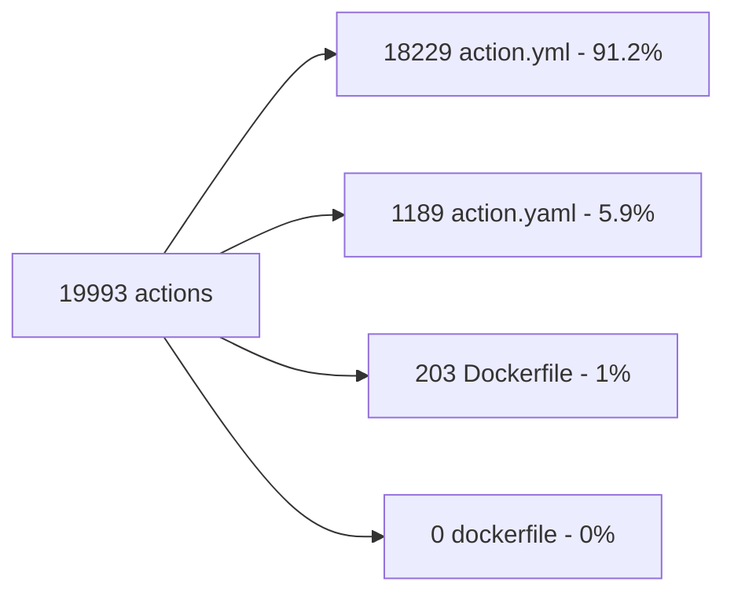
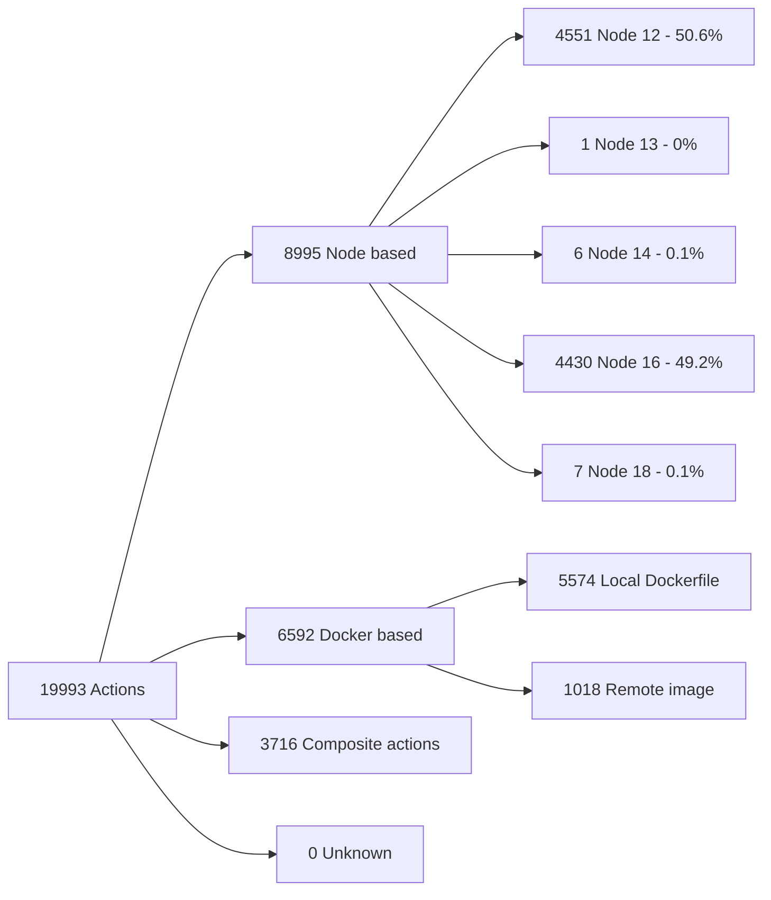

GitHub Actions does not have a way to stay up to date with the extension updates or new extensions being added. This site will show you the updates and has an RSS feed option to see updates in your favorite RSS tool. Made by [Rob Bos](https://github.com/rajbos).

This builds on the work done for scanning the actions marketplace, to dive deeper into:
- News and Updates
- Composition: Node based, Docker container, or Composite action
- Dependencies used (and what is vulnerable!)
- Last updated, what will break with the Node16 breaking change in the environment
- Verified or not

Read more on this research on [devopsjournal.io](https://devopsjournal.io/blog/2022/09/18/Analysing-the-GitHub-marketplace).
You can check the latest run of the marketplace composition [here](https://github.com/rajbos/actions-marketplace-checks/actions/workflows/report.yml), where you can find the latest report in the summary.

# Examples from the scan on 12-08-2023:

----

